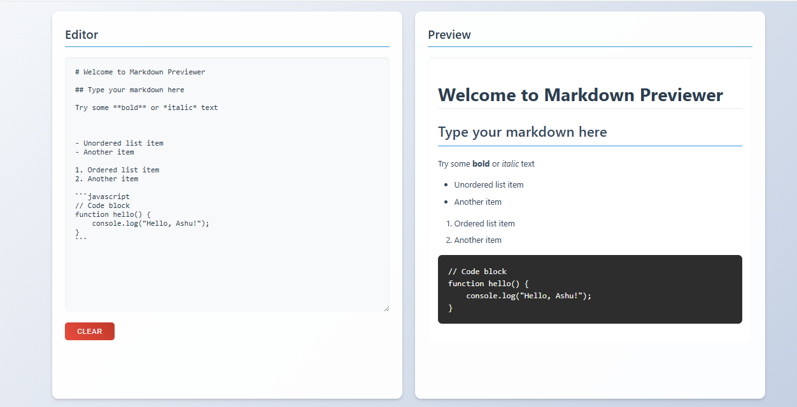

# Markdown Previewer

A simple web application that allows users to write Markdown and see a real-time preview of the formatted output.

## Features

- Real-time Markdown preview
- Support for basic Markdown syntax:
  - Headings (#, ##, ###)
  - Bold and italic text
  - Links
  - Ordered and unordered lists
  - Code blocks (inline and multi-line)
- Clear button to reset the editor
- Responsive design for mobile and desktop
- Default sample content

## Screenshots



## Deployment

[Live Demo](https://markdown-previewer-six-smoky.vercel.app/)

## Setup

1. Clone the repository:

```bash
git clone https://github.com/your-username/markdown-previewer.git
```
